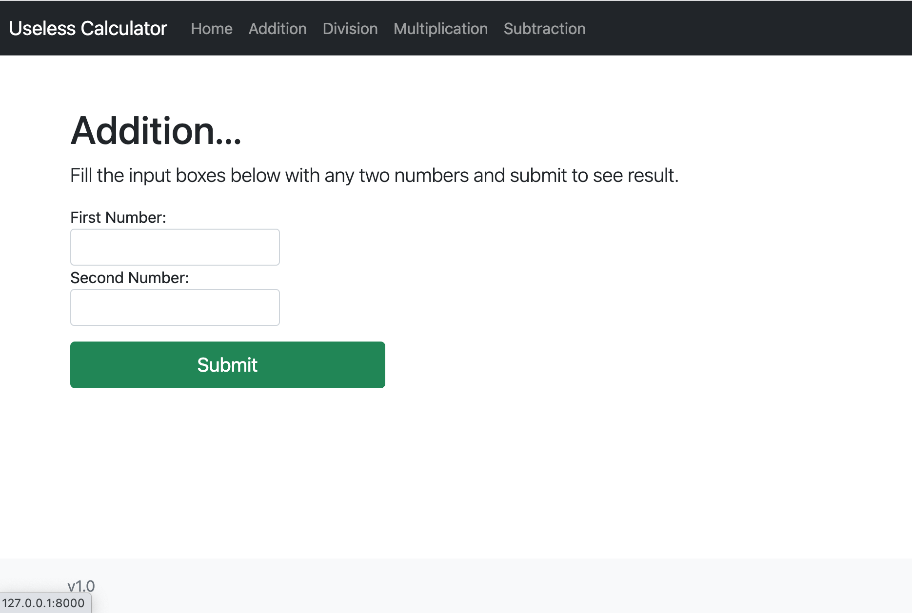
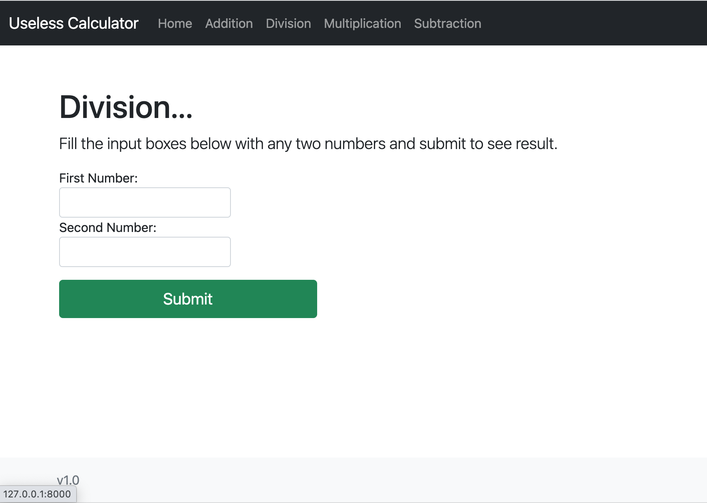

# Useless Calculator Project

This project is a demo used in microservice deployment training. As you might have guessed, the app is pretty useless and definitely buggy. 
DO NOT TAKE IT TO PROD, except in a demo environment.

The other microservices that make this project complete are;
- [Addition Service](https://github.com/solvedevops/addition-service)
- [Division Service](https://github.com/solvedevops/division-service)
- [Multiplication Service](https://github.com/solvedevops/multiplication-service)
- [Subtration Service](https://github.com/solvedevops/subtraction-service)

You are free to use it how ever you please.

### TechStack
- FastApi
- Python
- HTML
- Bootstrap

###  Screenshots

